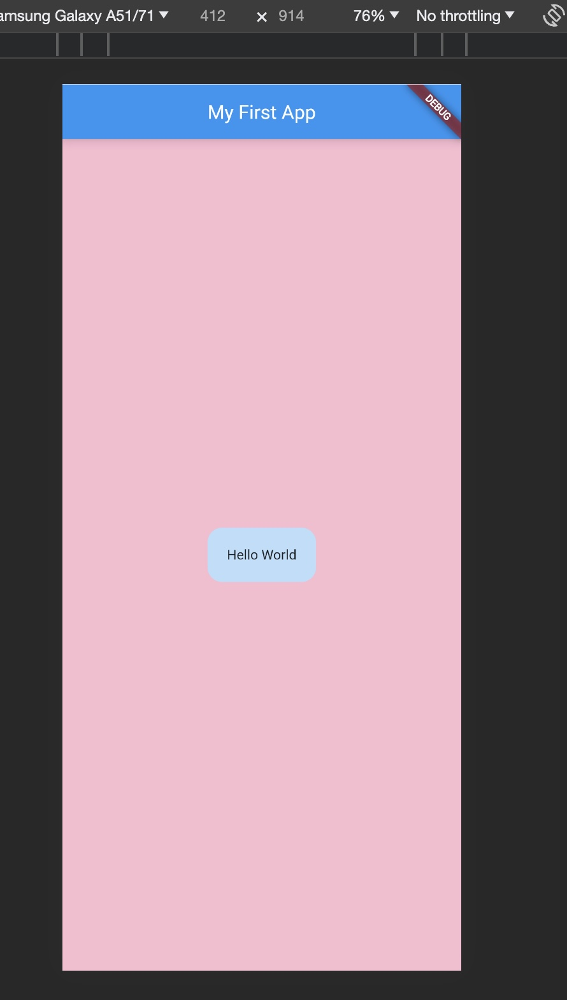

# Section 2: Flutter & Dart Basics | - Getting a Solid Foundation [ROLL DICE APP]

## Flutter and Dart

- **Flutter** is a toolkit to create apps for Android, iOS, web, and more.
- **Dart** is the language you write your Flutter apps in. It's straightforward to learn, especially if you've seen any programming language before.

### Basic Concepts

- **Widgets**: These are the building blocks of a Flutter app. Everything you see on the screen (and some things you don’t) are widgets. Examples: Text, Image, Button, etc.

- **main() function**: This is where your app starts running. Every app must have a `main()`.

- **StatelessWidget**: A type of widget that doesn’t change after it’s created. For example, Text widget might be stateless because once you set the text, it usually doesn’t change.


### Step 1: Simplest Flutter App

```dart
import 'package:flutter/material.dart';

void main() {
  runApp(MaterialApp(
    home: Text("Hello World"),
  ));
}
```
This code creates a Flutter app that displays "Hello World" text, but it lacks some structure. Usually, even in the simplest app, we wrap our `Text` widget with something to give a bit more structure to the visual appearance.

### Step 2: Adding a Bit More Structure
Let's add a `Scaffold` widget which provides a top-level container that can hold structure and visual elements:

```dart
import 'package:flutter/material.dart';

void main() {
  runApp(MaterialApp(
    home: Scaffold(
      body: Text("Hello World"),
    ),
  ));
}
```
- `Scaffold`: Think of this as a white canvas where you can draw or place different widgets.

But this will give the text at the top-left of the screen, let's center it.

### Step 3: Centering the Text
We use a `Center` widget to place our text widget in the center of the screen.

```dart
import 'package:flutter/material.dart';

void main() {
  runApp(MaterialApp(
    home: Scaffold(
      body: Center(
        child: Text("Hello World"),
      ),
    ),
  ));
}
```
- `Center`: Does exactly what it sounds like! Takes a widget (`child`) and puts it smack dab in the middle.

### Step 4: Adding an App Bar
Let's add an `AppBar` to make it look a bit more like a standard mobile app:

```dart
import 'package:flutter/material.dart';

void main() {
  runApp(MaterialApp(
    home: Scaffold(
      appBar: AppBar(
        title: Text("My First App"),
      ),
      body: Center(
        child: Text("Hello World"),
      ),
    ),
  ));
}
```
- `AppBar`: A Material Design app bar that can hold titles, icons, and actions.
  
### Step 5: Make it Customizable
We can extract the text display functionality into a separate widget. This is great because it keeps things clean and modular.

```dart
import 'package:flutter/material.dart';

void main() {
  runApp(MaterialApp(
    home: MyApp(),
  ));
}

class MyApp extends StatelessWidget {
  @override
  Widget build(BuildContext context) {
    return Scaffold(
      appBar: AppBar(
        title: Text("My First App"),
      ),
      body: Center(
        child: Text("Hello World"),
      ),
    );
  }
}
```
- `MyApp`: A custom widget that we’ve defined to clean things up and potentially reuse elsewhere.

Great! Adding a background color is a fun step. You can set the background color by modifying the `Scaffold` widget in your `MyApp` class. Let’s use the `backgroundColor` property:

### Step 6: Adding a Background Color

```dart
import 'package:flutter/material.dart';

void main() {
  runApp(MaterialApp(
    home: MyApp(),
  ));
}

class MyApp extends StatelessWidget {
  @override
  Widget build(BuildContext context) {
    return Scaffold(
      appBar: AppBar(
        title: Text("My First App"),
      ),
      body: Center(
        child: Text("Hello World"),
      ),
      backgroundColor: Colors.blue[100],  // Adding background color here!
    );
  }
}
```

Here:
- `backgroundColor: Colors.blue[100],`: We added a light blue color as the background of the entire screen. `Colors.blue[100]` refers to a lighter shade of blue from the Material Design color palette.

In Flutter, `Colors` is a predefined class that offers a variety of color options to use. So you can try changing `Colors.blue[100]` to `Colors.green`, `Colors.yellow`, `Colors.red`, etc. to see different background colors! Also, you can select different shades of a color (like `Colors.blue[50]`, `Colors.blue[200]`, and so on).


> ### `Container`: A Closer Look
> In Flutter, a `Container` widget is like a box model. It can contain other widgets and allows you to customize the dimensions, padding, margin, decoration, and more. In simpler words, think of it as **a box where you can place stuff with options to style it**.
> ### Adding a `Container` to Your Code

Let's modify your code snippet to utilize a `Container`:

```dart
import 'package:flutter/material.dart';

void main() {
  runApp(MaterialApp(
    home: MyApp(),
  ));
}

class MyApp extends StatelessWidget {
  @override
  Widget build(BuildContext context) {
    return Scaffold(
      appBar: AppBar(
        title: const Text("My First App"),
      ),
      body: Center(
        child: Container(  // Adding Container here
          padding: EdgeInsets.all(20.0),
          margin: EdgeInsets.all(15.0),
          decoration: BoxDecoration(
            color: Colors.blue[100],
            borderRadius: BorderRadius.circular(15),
          ),
          child: Text("Hello World"),
        ),
      ),
      backgroundColor: Colors.pink[100],
    );
  }
}
```

### What Did We Do with the `Container`?

1. **padding**: `EdgeInsets.all(20.0)`, creates space _inside_ the container, between the content (the `Text` widget) and the walls of the container.

2. **margin**: `EdgeInsets.all(15.0)`, creates space _outside_ the container, between the container and its surrounding widgets.

3. **decoration**: This lets us style the visual aspects of the container.
   
   - `color: Colors.blue[100]`, sets the color of the container.
   
   - `borderRadius: BorderRadius.circular(15)`, gives the container rounded corners.
	
	>`BoxDecoration` class provides a variety of ways to decorate a box. For instance, you might want to add borders, circular edges, shadows, gradients, or even a background image.


4. **child**: We put a `Text` widget here, but it could be any widget. This is what’s inside the box.

### Some Usage Tips:

- You can use a `Container` to group widgets together and apply common styling to them.

- `Container` is also useful to create space between widgets, apply backgrounds, create shapes, and help with layout.


> In Flutter, we don't use `rem` or `px` as units for size. Flutter just uses logical pixels (essentially just "pixels"), abstracting away the physical pixels of the screen. The beauty of this is that you don’t have to worry about different screen densities on different devices – Flutter handles all of that for you.

Here's a quick breakdown:

- **Pixels in Flutter**: A logical pixel might contain multiple physical pixels, but you don’t have to worry about that. If you specify a square of `100` pixels, it might be `100` physical pixels on one device, and `200` or `300` on a device with a higher pixel density.

- **Scaling**: Flutter manages the scaling quite well out of the box, ensuring consistency across devices. If you do want to add specific sizes based on the screen size, you can use media queries to determine the dimensions and then calculate sizes accordingly.

Here's an example of adjusting size using the screen width:

```dart
import 'package:flutter/material.dart';

void main() {
  runApp(MaterialApp(
    home: MyApp(),
  ));
}

class MyApp extends StatelessWidget {
  @override
  Widget build(BuildContext context) {
    double width = MediaQuery.of(context).size.width; // Getting screen width

    return Scaffold(
      appBar: AppBar(
        title: const Text("Responsive App"),
      ),
      body: Center(
        child: Container(
          width: width * 0.8,  // Using 80% of screen width
          padding: EdgeInsets.all(20.0),
          decoration: BoxDecoration(
            color: Colors.blue[100],
            borderRadius: BorderRadius.circular(15),
          ),
          child: const Text("Hello World"),
        ),
      ),
      backgroundColor: Colors.pink[100],
    );
  }
}
```
In this code snippet:
- `MediaQuery.of(context).size.width` fetches the screen width.
- `width * 0.8` makes the container take up 80% of the screen width.

In this way, you can create somewhat responsive designs by using fractions of screen dimensions instead of fixed pixel values, ensuring a consistent look across different screen sizes!

	



## `Container` vs `BoxDecoration`

The `Container` widget and `BoxDecoration` class in Flutter serve different, albeit related, purposes.

### `Container` Widget:
- **What is it?** The `Container` is a convenience widget that combines common painting, positioning, and sizing widgets into a single widget.
- **When to Use?** Use it when you want to envelop another widget and apply some visual and structural styling like padding, margins, width/height, and more.
- **Key Properties**:
  - `child`: Takes a single widget and makes it its child.
  - `padding`: Adds space inside the container, between the boundary and the child.
  - `margin`: Adds space outside the container.
  - `width` and `height`: Control its size.
  - `decoration`: Applies visual styling like color, shadow, shapes, etc. (more on this below).

### `BoxDecoration` Class:
- **What is it?** `BoxDecoration` is NOT a widget but a class that provides various ways to decorate a `Container`.
- **When to Use?** Use it with the `decoration` property of `Container` when you want to apply more intricate stylings like gradients, shadows, and shapes.
- **Key Properties**:
  - `color`: Sets the background color.
  - `border`: Allows setting border styles.
  - `borderRadius`: Enables rounded corners.
  - `gradient`: Applies gradients.
  - `image`: Places background images.
  - `boxShadow`: Adds shadows.
  - `shape`: Defines the shape (like `BoxShape.circle` for a circle).

### Connection Between `Container` and `BoxDecoration`:

- The `Container` widget has a `decoration` property.
- This `decoration` property takes an instance of `BoxDecoration` to apply advanced styling.
- You cannot use `color` directly inside `Container` alongside `decoration` - the `color` should be defined within `BoxDecoration` if you're using it.

#### Example:
```dart
Container(
  padding: EdgeInsets.all(16.0),
  margin: EdgeInsets.all(8.0),
  decoration: BoxDecoration(
    color: Colors.blue,  // NOT directly inside `Container`
    boxShadow: [
      BoxShadow(color: Colors.grey, blurRadius: 4.0),
    ],
  ),
  child: Text('Hello World'),
)
```

### Quick Summary:
- `Container` is a versatile widget that optionally allows you to adjust its dimensions, padding, margin, and decoration.
- `BoxDecoration` is used with the `decoration` property of `Container` to apply advanced stylings like gradients, shadows, and shapes.
- While `Container` handles layout and some simple visual properties, `BoxDecoration` dives deeper into visual properties.


## Generics & Lists

Let’s jump into the world of Generics and Lists in Dart!

### 1. Generics:

Generics are a powerful feature in Dart (and in many programming languages, like Java and C#) that allows you to write a single class or function that works with different types.

**Why Use Generics?**

- **Type Safety**: Ensures that you are using the intended data type, catching potential issues during analysis instead of runtime.
- **Code Reusability**: Write code once and reuse it with different data types.

**Basic Syntax:**

```dart
class Box<T> {
  final T value;
  Box(this.value);
}

var stringBox = Box<String>('Hello');
var intBox = Box<int>(42);
```
In the class `Box`, `T` is a placeholder type. When you create a new `Box`, you replace `T` with a real type, like `String` or `int`.

### 2. Lists:

A `List` in Dart is an ordered collection of items, similar to arrays in other languages.

**Basic Usage:**

```dart
var myList = [1, 2, 3];
```
Here, `myList` is a list that stores integers.

**Defining a List with a Specific Type:**

```dart
List<int> myList = [1, 2, 3];
```
Here, `myList` can only store integers, providing type safety.

### Mixing Generics and Lists:

You can combine generics and lists to create lists that ensure type safety and code reusability.

**Example:**

```dart
class Box<T> {
  final T value;
  Box(this.value);
}

void main() {
  var boxes = <Box<int>>[];
  boxes.add(Box(1));
  boxes.add(Box(2));
  
  for (var box in boxes) {
    print(box.value);
  }
}
```

Here, `Box<int>` indicates that we're using a `Box` that should store `int` values, and `boxes` is a list that stores `Box<int>` objects.

### Explanation:

- `Box<T>`: A generic class that works with any type `T`.
- `<Box<int>>`: Indicates that the list should store `Box` objects that work with `int` values.
- `boxes.add(Box(1));`: Adds a `Box` object, initialized with an integer, to the list.
- The `for` loop: Iterates through each box in `boxes`, printing the integer value stored in each box.

### Exploring Further:

1. **Generics with Functions**:
   You can also use generics with functions to make them work with different types.

   Example:
   ```dart
   T firstItem<T>(List<T> list) {
     return list[0];
   }
   ```
   
   This function, `firstItem`, returns the first item of a list and works with any type `T`.

2. **Other Collection Types**:
   Explore other collection types like `Set` and `Map` which can also use generics to ensure type safety and flexibility.
   
   
## Constructor and Custom Widgets in Flutter

### What's a Constructor ?

A basic constructor has the same name as the class and doesn't return a value.

```dart
class Greeting {
  String greetingText;

  // Constructor
  Greeting(String text) {
    this.greetingText = text;
  }
}
```
### Constructor with Named Parameters

You might want to use named parameters for better readability and flexibility.

```dart
class Greeting {
  String greetingText;

  // Constructor with named parameters
  Greeting({required String text}) {
    this.greetingText = text;
  }
}
```

### Constructor with Syntactic Sugar

Dart provides a shortcut (syntactic sugar) for assigning constructor parameters to class properties.

```dart
class Greeting {
  String greetingText;

  // Constructor with syntactic sugar
  Greeting({required this.greetingText});
}
```

### Utilizing Constructors in Flutter

In Flutter, constructors are commonly used to initialize a widget's properties. For example:

```dart
class GreetingWidget extends StatelessWidget {
  final String greetingText;

  // Constructor
  GreetingWidget({required this.greetingText});

  @override
  Widget build(BuildContext context) {
    return Text(greetingText);
  }
}
```

### Usage of Custom Widget with Constructor

You might use the custom widget `GreetingWidget` with a constructor like so:

```dart
GreetingWidget(greetingText: 'Hello, Flutter!')
```


### Let’s Build a Custom Widget Together!

Suppose you want to create a custom widget that displays a greeting message inside a nicely styled box. 

```dart
class GreetingBox extends StatelessWidget {
  final String greetingText;

  // Constructor
  GreetingBox({required this.greetingText});

  @override
  Widget build(BuildContext context) {
    return Container(
      padding: EdgeInsets.all(16),
      decoration: BoxDecoration(
        color: Colors.blue,
        borderRadius: BorderRadius.circular(8),
      ),
      child: Text(
        greetingText,
        style: TextStyle(color: Colors.white, fontSize: 20),
      ),
    );
  }
}
```

### Explanation:

- **`GreetingBox`**: The name of your new custom widget.
  
- **`final String greetingText;`**: A `final` variable to hold the greeting message that will be displayed by the widget. It’s set through the constructor, so it must be provided when creating a `GreetingBox`.

- **`GreetingBox({required this.greetingText});`**: The constructor. It initializes `greetingText` and is marked `required` meaning you must provide a value when you create a `GreetingBox`.

- **`Container`**: A box model that can contain other widgets. Here it contains a `Text` widget and has some styling.

- **`padding`**: Adds some space around the text inside the container.
  
- **`decoration`**: Allows to style the box, including setting a background color and border radius to get rounded corners.

- **`child`**: The widget below in the tree. Here it’s a `Text` widget showing `greetingText`.

### Usage Example:

```dart
void main() {
  runApp(MaterialApp(
    home: MyApp(),
  ));
}

class MyApp extends StatelessWidget {
  @override
  Widget build(BuildContext context) {
    return Scaffold(
      appBar: AppBar(
        title: Text("Custom Widget Example"),
      ),
      body: Center(
        child: GreetingBox(greetingText: "Hello, Flutter!"),
      ),
    );
  }
}
```
- **`GreetingBox(greetingText: "Hello, Flutter!")`**: This is how you use your custom widget, providing the greeting message as a parameter.

And voila! You have a custom widget that displays a greeting message in a styled box, which you can reuse anywhere in your app by passing different greeting messages! 🎉💻🚀

Constructors in Dart (and in Flutter, which is built with Dart) are special methods that are used to create an instance of a class. In the context of Flutter, constructors allow developers to configure their widgets with initial data.

## Introducing variables

### 1. Variables & Types - Combining Two Key Concepts

In Dart, variables hold a reference to a value. Unlike JavaScript, Dart is statically typed, meaning that the data type is checked before runtime. Although Dart has type inference which allows you to omit types, specifying them can prevent type-related bugs.

Example:

```dart
String name = 'Dart'; // explicit type
var age = 30; // type inferred as int
```

In JavaScript:

```javascript
let name = 'JavaScript';
let age = 30;
```

### 2. "final" & "const" - Special Kinds Of "Variables"

- **`final`**: Once a `final` variable has a non-null value assigned, it cannot be changed.
  
  ```dart
  final String language = 'Dart';
  ```
  In JS, `const` may resemble `final`, but `final` doesn’t exist in JS.
  
- **`const`**: A `const` variable is a compile-time constant. `const` variables are implicitly `final`.

  ```dart
  const double pi = 3.141592653589793;
  ```
  Both `final` and `const` cannot be reassigned once they are assigned a value, unlike `let` or `var` in JavaScript.

### 3. Instance Variables (Properties) & Configurable Widgets

In Dart and Flutter, you often create widgets with configurable properties (instance variables) via the constructor.

Here's a simple widget in Flutter:

```dart
class GreetingBox extends StatelessWidget {
  final String greetingText;
  
  // Constructor
  GreetingBox({required this.greetingText});
  
  @override
  Widget build(BuildContext context) {
    return Text(greetingText);
  }
}
```

- **`greetingText`**: An instance variable (or property) of `GreetingBox`.
  
- **Constructor**: Through the constructor, you can assign a value to `greetingText` when creating a new instance of `GreetingBox`.

You use the widget like this:

```dart
GreetingBox(greetingText: 'Hello, Flutter!');
```

In a React (JS library) component, you might achieve something similar via props:

```javascript
function GreetingBox({ greetingText }) {
  return <p>{greetingText}</p>;
}
```

Usage:

```javascript
<GreetingBox greetingText="Hello, React!" />
```

>#### Additional Notes
>- **Static Typing**: Dart’s static typing allows errors to be caught during development. This might prevent certain types of runtime errors that can occur with JavaScript.
>- **Null Safety**: Dart has a built-in null safety feature that ensures variables cannot be null unless explicitly specified, unlike JavaScript, which does not inherently prevent null or undefined issues.


### Understanding `dynamic` in Dart (`any`)

In Dart, `dynamic` is a type underlying all variables. When you use `dynamic`, you are opting out of the static type checking. This means that the type checker allows any value for variables declared as `dynamic` and doesn’t check the validity of method calls on such variables.

#### Example Usage:

```dart
dynamic name = 'Flutter';
name = 42; // No error here
```

You can also call methods and access properties on `dynamic` variables without static type checking:

```dart
dynamic text = 'Hello';
print(text.toLowerCase()); // No error at compile time, checked at runtime
```

### Use Cases:

- **API Data**: When working with API data, you may not always know the type of data you're retrieving. `dynamic` allows you to work with this data and later cast it to a more specific type when necessary.
  
- **Generic Programming**: When creating generic functions or classes where you wish to leave the type flexible.

- **Interacting with JavaScript**: When working with JavaScript using `dart:js` or `package:js`, variables from JS are of type `dynamic` because JavaScript is dynamically typed.

### When to Use/Not Use `dynamic`:

👍 **Use when**:
- You’re certain about the type of variable at runtime.
- You’re dealing with data where the structure isn't known at compile time.

👎 **Avoid when**:
- You can specify a type – making use of Dart’s type system is beneficial for catching bugs during development.
  
### Comparing to JavaScript:

- JavaScript is dynamically typed by nature. Any variable can hold any type of value without specifying its type.
- Dart’s `dynamic` essentially brings JavaScript-like flexibility to Dart.

### Example:

```dart
void main() {
  dynamic variable = 'Hello, Flutter!';
  print(variable);

  variable = 42;
  print(variable);
}
```
Output:

```
Hello, Flutter!
42
```
In Dart, using `dynamic` might remind you of JavaScript's flexibility, but remember that utilizing Dart's static typing capabilities wherever possible is often considered good practice to catch errors early and make code more understandable.


## Practice: reusable widget

Given:

```
// ignore_for_file: prefer_const_constructors

import 'package:first_app/components/greeting_box.dart';
import 'package:flutter/material.dart';

void main() {
  runApp(MaterialApp(
    home: MyApp(),
  ));
}

class MyApp extends StatelessWidget {
  @override
  Widget build(BuildContext context) {
    return Scaffold(
      appBar: AppBar(
        title: const Text("Gradient Background App"),
      ),
      body: Container(
        decoration: BoxDecoration(
          gradient: LinearGradient(
            begin: Alignment.topLeft,
            end: Alignment.bottomRight,
            colors: [Colors.blue, Colors.red], // Gradient colors
          ),
        ),
        child: GreetingBox(greetingText: "Hello World"),
      ),
    );
  }
}

```


we want to extract the gradient background into a reusable widget. Below is a simple way to achieve that:

### GradientBackground.dart

Here we create a reusable widget named `GradientBackground`. 

```
import 'package:flutter/material.dart';

class GradientBackground extends StatelessWidget {
  final Widget child;
  final AlignmentGeometry begin;
  final AlignmentGeometry end;
  final List<Color> colors;

  // Constructor without default values
  GradientBackground({
    required this.child,
    required this.begin,
    required this.end,
    required this.colors,
  });

  @override
  Widget build(BuildContext context) {
    return Container(
      decoration: BoxDecoration(
        gradient: LinearGradient(
          begin: begin,
          end: end,
          colors: colors,
        ),
      ),
      child: child,
    );
  }
}
```


### Usage in Your App

Now you can use `GradientBackground` in your main app file or any other widget file by passing the child widget you want to display on the gradient.

```
import 'package:flutter/material.dart';
import 'package:your_package_name/components/gradient_background.dart';
import 'package:your_package_name/components/greeting_box.dart';

void main() {
  runApp(MaterialApp(
    home: MyApp(),
  ));
}

class MyApp extends StatelessWidget {
  @override
  Widget build(BuildContext context) {
    return Scaffold(
      appBar: AppBar(
        title: const Text("Gradient Background App"),
      ),
      body: GradientBackground(
        begin: Alignment.topCenter,
        end: Alignment.bottomCenter,
        colors: [Colors.green, Colors.yellow],
        child: GreetingBox(greetingText: "Hello World"),
      ),
    );
  }
}

```

### Explanation:

- **GradientBackground**: This new widget takes a `child` as a parameter and renders it on top of the gradient. This way, you can reuse the gradient functionality while displaying different content on top.

- **Usage**: The `GradientBackground` widget is used in your `MyApp` widget, and a `GreetingBox` is passed as a child to it. Thus, "Hello World" is displayed on the gradient.


## Images


### Step 1: Set Up Your Asset Folder
Place your image files in a folder inside your Flutter project. Conventionally, a folder named `assets` at the root of the Flutter project is used. 

Project structure example:

```
my_flutter_app/
├── assets/
│   ├── image1.png
│   └── image2.jpg
├── lib/
│   └── main.dart
├── pubspec.yaml
└── ...
```

### Step 2: Declare Assets in `pubspec.yaml`
In your `pubspec.yaml`, declare the assets you want to use under `flutter:`. Ensure that the indentation is correct (YAML files are sensitive to indentation) and that your file paths are correct.

```yaml
flutter:
  assets:
    - assets/image1.png
    - assets/image2.jpg
```

Or to include all images in the assets folder:

```yaml
flutter:
  assets:
    - assets/
```
After updating `pubspec.yaml`, don't forget to save the file and run `flutter pub get` in the terminal to update the project dependencies.

### Step 3: Use the Asset Image in Your Code

In your Dart code, use the `Image.asset` constructor to display the image.

Example usage in `main.dart`:

```dart
import 'package:flutter/material.dart';

void main() {
  runApp(MyApp());
}

class MyApp extends StatelessWidget {
  @override
  Widget build(BuildContext context) {
    return MaterialApp(
      home: Scaffold(
        appBar: AppBar(title: Text("Asset Image Example")),
        body: Center(
          child: Image.asset('assets/image1.png'),
        ),
      ),
    );
  }
}
```

In this code snippet:
- `Image.asset('assets/image1.png')`: This line of code tells Flutter to create an image widget that loads and displays the image located at `assets/image1.png`.

#### Multiple images 

If you'd like to display multiple images in your Flutter app, you can use a widget that allows for the layout of multiple children, such as `Column`, `Row`, or `ListView`. 

Here's how you might modify your code to display multiple images vertically using 
`Column`:

```dart
child: Center(
  child: Column(
    mainAxisAlignment: MainAxisAlignment.center,
    children: [
      Image.asset('assets/images/dice-1.png'),
      Image.asset('assets/images/dice-2.png'),
      Image.asset('assets/images/dice-3.png'),
    ],
  ),
),
```

In this snippet:

- `Column`: A widget that displays its children in a vertical array.
- `mainAxisAlignment: MainAxisAlignment.center,`: This centers the column's children along the main axis (vertically, in this case).
- `children: [...]`: A list of widgets that the `Column` displays.

If you wanted to display them horizontally instead, you could use a `Row` widget, which works similarly to `Column` but in the horizontal axis:

```dart
child: Center(
  child: Row(
    mainAxisAlignment: MainAxisAlignment.center,
    children: [
      Image.asset('assets/images/dice-1.png'),
      Image.asset('assets/images/dice-2.png'),
      Image.asset('assets/images/dice-3.png'),
    ],
  ),
),
```
For displaying a list of images that the user can scroll through, consider using a `ListView`:

```dart
child: ListView(
  children: [
    Image.asset('assets/images/dice-1.png'),
    Image.asset('assets/images/dice-2.png'),
    Image.asset('assets/images/dice-3.png'),
  ],
),
```

It works! But we have also and **error** in the console:


```
the overflowing RenderFlex has an orientation of Axis.vertical.
The edge of the RenderFlex that is overflowing has been marked in the rendering with a yellow and
black striped pattern. This is usually caused by the contents being too big for the RenderFlex.
Consider applying a flex factor (e.g. using an Expanded widget) to force the children of the
RenderFlex to fit within the available space instead of being sized to their natural size.
This is considered an error condition because it indicates that there is content that cannot be
seen. If the content is legitimately bigger than the available space, consider clipping it with a
ClipRect widget before putting it in the flex, or using a scrollable container rather than a Flex,
like a ListView.
The specific RenderFlex in question is: RenderFlex#eb330 relayoutBoundary=up4 OVERFLOWING:
  creator: Column ← Center ← Padding ← DecoratedBox ← Container ← KeyedSubtree-[GlobalKey#69198] ←
    _BodyBuilder ← MediaQuery ← LayoutId-[<_ScaffoldSlot.body>] ← CustomMultiChildLayout ←
    _ActionsScope ← Actions ← ⋯
  parentData: offset=Offset(0.0, 0.0) (can use size)
  constraints: BoxConstraints(0.0<=w<=414.0, 0.0<=h<=840.0)
  size: Size(414.0, 840.0)
  direction: vertical
  mainAxisAlignment: center
  mainAxisSize: max
  crossAxisAlignment: center
  verticalDirection: down
◢◤◢◤◢◤◢◤◢◤◢◤◢◤◢◤◢◤◢◤◢◤◢◤◢◤◢◤◢◤◢◤◢◤◢◤◢◤◢◤◢◤◢◤◢◤◢◤◢◤◢◤◢◤◢◤◢◤◢◤◢◤◢◤◢◤◢◤◢◤◢◤◢◤◢◤◢◤◢◤◢◤◢◤◢◤◢◤◢◤◢◤◢◤◢◤◢◤◢◤
════════════════════════════════════════════════════════════════════════════════════════════════════

```


If the images in your `Column` widget are too large in total for the available vertical space, you'll encounter an overflow error. Let’s address it:

1. **Using `Expanded`**: If you want the images to fill the available space without scrolling and resizing them proportionally, wrap them with `Expanded` or `Flexible` widget.

2. **Using `SingleChildScrollView`**: If you want the images to maintain their size and be scrollable if there isn't enough space, wrap the `Column` in a `SingleChildScrollView`.

### Option 1: Using Expanded

```dart
Column(
  mainAxisAlignment: MainAxisAlignment.center,
  children: [
    Expanded(child: Image.asset('assets/images/dice-1.png')),
    Expanded(child: Image.asset('assets/images/dice-2.png')),
    Expanded(child: Image.asset('assets/images/dice-3.png')),
  ],
)
```
### Option 2: Using SingleChildScrollView

```
child: Center(
  child: SingleChildScrollView(
    // Added SingleChildScrollView
    child: Column(
      mainAxisAlignment: MainAxisAlignment.center,
      children: [
        Image.asset('assets/images/dice-1.png'),
        Image.asset('assets/images/dice-2.png'),
        Image.asset('assets/images/dice-3.png'),
      ],
    ),
  ),
),
```

### Option 3: Resizing Images
If you want the images to always appear in their full size, and that size is too large for some screens, you can resize the images either manually (in an image editor) or dynamically in code:

```dart
Column(
  mainAxisAlignment: MainAxisAlignment.center,
  children: [
    Image.asset('assets/images/dice-1.png', height: 100), // Set height or width as per your need.
    Image.asset('assets/images/dice-2.png', height: 100),
    Image.asset('assets/images/dice-3.png', height: 100),
  ],
)
```

>### Note
>Choose the option that aligns best with your UI/UX expectations. If you want all images to always be fully visible, you may need to ensure they're sized accordingly or make use of `Expanded`. If you want to display them in their full size and that could exceed the screen height, you should opt for a scrolling mechanism with `SingleChildScrollView`. If your images can be resized to a smaller dimension, adjusting the height or width might be a viable solution.


## Adding Buttons
Flutter offers several types of buttons like `ElevatedButton`, `TextButton`, and `FlatButton`, each with their own style and usage.

**Example: Using `TextButton`**

```
TextButton(
  onPressed: () {
    print('Button Pressed!');
  },
  child: Text(
    'Roll Dice'
  ),
)

```

Here:

- `onPressed: () {...}`: Defines the function that will be executed when the button is pressed.
- `child`: Takes a widget (often a `Text` widget) to define what's displayed on the button.

### Using Functions as Values
In Dart (and therefore Flutter), functions are first-class citizens, meaning they can be passed as parameters, stored in variables, and more. 

**Example: Passing a Function**

```dart
void myFunction() {
  print('Function Called!');
}

ElevatedButton(
  onPressed: myFunction,
  child: Text('Call Function'),
)
```

In this case, `myFunction` (without parentheses) is passed as the `onPressed` parameter and will be called when the button is pressed.


### Styling Button

```
children: [
    Image.asset('assets/images/dice-2.png', width: 200),
    TextButton(
        onPressed: rollDice,
        style: TextButton.styleFrom(
            padding: EdgeInsets.only(top: 20),
            foregroundColor: Colors.white,
            textStyle: TextStyle(fontSize: 28)),
        child: Text('Roll Dice'))
],

```


Yes, your example is a valid and good use of `TextButton.styleFrom` as well. 

Here's your code snippet:

```dart
children: [
    Image.asset('assets/images/dice-2.png', width: 200),
    TextButton(
        onPressed: rollDice,
        style: TextButton.styleFrom(
            padding: EdgeInsets.only(top: 20),
            foregroundColor: Colors.white,
            textStyle: TextStyle(fontSize: 28)),
        child: Text('Roll Dice'))
],
```

In this snippet:

- `padding: EdgeInsets.only(top: 20)`: This will add padding only to the top of the button, moving the text down a bit inside the button. Note that this padding is inside the button itself.
- `foregroundColor: Colors.white`: This sets the color of the button's text.
- `textStyle: TextStyle(fontSize: 28)`: This sets the text style for the button's child `Text` widget.


## Stateful Widget

To achieve the image change on button press with the current code, we'll need to refactor it to use a `StatefulWidget` because changing the content (in this case, the image) on user interaction requires maintaining a mutable state.

Here's a refactored version of the code:

```
import 'package:flutter/material.dart';

void main() {
  runApp(MaterialApp(
    home: MyApp(),
  ));
}

class MyApp extends StatefulWidget {
  @override
  MyAppState createState() => MyAppState();
}

class MyAppState extends State<MyApp> {
  String diceImage = 'assets/images/dice-2.png';

  void rollDice() {
    setState(() {
      diceImage = 'assets/images/dice-6.png'; 
    });
    print('Button Pressed!');
  }

  @override
  Widget build(BuildContext context) {
    return Scaffold(
      appBar: AppBar(
        title: const Text("Gradient Background App"),
      ),
      body: Container(
        decoration: BoxDecoration(
          gradient: LinearGradient(
            begin: Alignment.topLeft,
            end: Alignment.bottomRight,
            colors: [Colors.blue, Colors.red],
          ),
        ),
        child: Center(
          child: Column(
            mainAxisAlignment: MainAxisAlignment.center,
            children: [
              Image.asset(diceImage, width: 200),
              TextButton(
                onPressed: rollDice,
                style: TextButton.styleFrom(
                    padding: EdgeInsets.only(top: 20),
                    foregroundColor: Colors.white,
                    textStyle: TextStyle(fontSize: 28)),
                child: Text('Roll Dice'),
              ),
            ],
          ),
        ),
      ),
    );
  }
}

```
Now, when you press the "Roll Dice" button, `rollDice` will change the `diceImage` path and because it is wrapped in a `setState`, Flutter will rebuild the UI with the new image.


### Let’s take a step back and look at what's happening in the code snippet:

```dart
class MyApp extends StatefulWidget {
  @override
  MyAppState createState() => MyAppState();
}
```

Here we're defining a new class `MyApp` that extends `StatefulWidget`, which means `MyApp` is now a widget that can maintain state over its lifetime.

Let's break down the concepts:

#### `StatefulWidget`:

In Flutter, widgets are either stateless or stateful. 

- `StatelessWidget`: Is a widget that describes part of the user interface which does not change dynamically. 
- `StatefulWidget`: Is a widget that can change dynamically, e.g., it can alter its appearance in response to user input or other events.

A `StatefulWidget` creates mutable state for a widget. It consists of two classes: the widget class and a separate state class. 

#### Creating a StatefulWidget:

1. **The Widget class**: 
   This class extends `StatefulWidget` and overrides the `createState` method to create an instance of the state class.

   ```dart
   class MyApp extends StatefulWidget {
     @override
     MyAppState createState() => MyAppState();
   }
   ```
   `createState` is a method that is called by Flutter to build the mutable state for your widget.

2. **The State class**: 
   The second class in a `StatefulWidget` is a persistent state class where you can keep any data that you want to persist across rebuilds of your widget. 
   
   It is separate from the widget itself, and it holds data that can change over time (the 'state' in `StatefulWidget`), whereas the widget might get built many times during its lifecycle, the state is persistent.

#### Example Usage:
   
```dart
class MyAppState extends State<MyApp> {
  //... rest of the class
}
```
Here, `MyAppState` is an object that stores the mutable state for `MyApp`.

In the code, when the `rollDice` method is called, `setState` is used to signal to Flutter framework that this `State` object has changed in some way, which causes the framework to schedule a rebuild of this Widget. The framework then calls the `build` method of this `State` object.


## Generating random number

In Dart, you can use the `Random` class from the `dart:math` library to generate random numbers. The `nextInt` method can be used to generate random integers. When you use `nextInt(6)`, it will give you a random integer between 0 and 5. Therefore, to get a random dice roll (between 1 and 6), you'll add 1 to the result.

Here's how you might implement a method that generates a random dice roll in your application:

```dart
import 'dart:math';

int rollDice() {
  return Random().nextInt(6) + 1;
}
```

And you can use it in your application like this:

```dart
void updateDiceImage() {
  setState(() {
    int roll = rollDice();  // Get random number between 1 and 6
    currentDiceImage = 'assets/images/dice-$roll.png';
  });
}
```

Here, the `updateDiceImage` method updates the state of your application to reflect a new dice roll whenever it is called. Calling `setState` tells the Flutter framework that the internal state of an object has changed in a way that might impact the user interface in this subtree, which causes the framework to schedule a build for this State object.

In the context of your `TextButton`, it can be utilized like so:

```dart
TextButton(
    onPressed: updateDiceImage,  // Call the updateDiceImage function when the button is pressed
    style: TextButton.styleFrom(
        padding: EdgeInsets.only(top: 20),
        foregroundColor: Colors.white,
        textStyle: TextStyle(fontSize: 28)),
    child: Text('Roll Dice'))
```
Whenever the button is pressed, `updateDiceImage` will be called, generating a new random dice roll and updating the displayed image accordingly.


